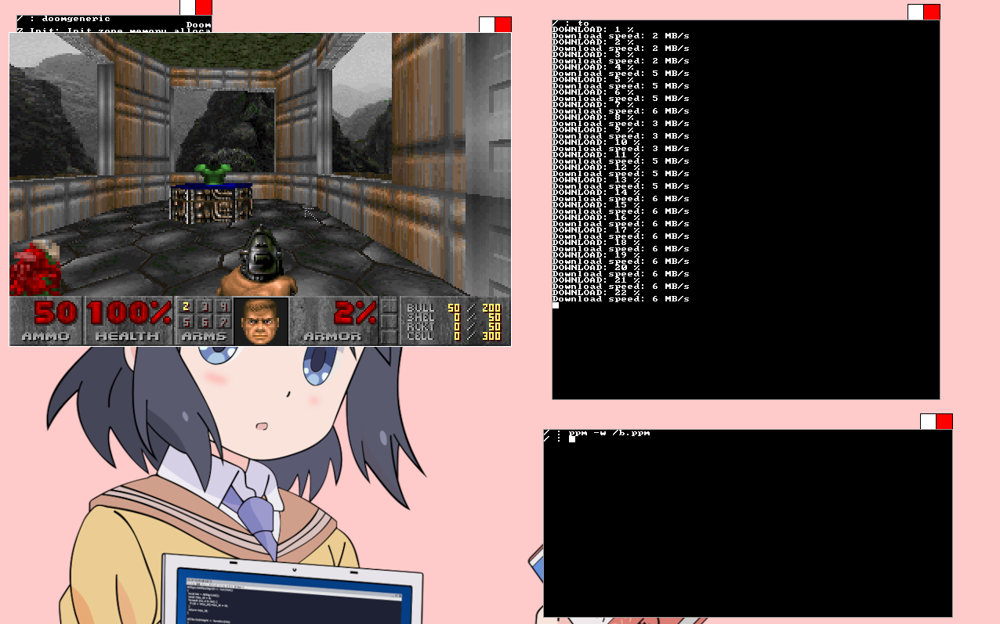

# sbOS

A mostly from scratch, UNIX like x86 hobbyist operating system. Kernel,
libc and the rest of the userland are written from scratch. It requires
a bootloader that supports the first version of multiboot(such as GRUB).

## Features

libc, userland programs, networking, file system, AHCI support etc

## Screenshot

sbOS running a torrent client which is downloading a GNU/linux ISO and DOOM([doomgeneric](https://github.com/ozkl/doomgeneric) created by [ozkl](https://github.com/ozkl))

Ignore the download speed as the timer is not well calibrated. Real
download speed is roughly 4 MB/s.

[wallpaper](https://files.catbox.moe/w5tufj.png)
